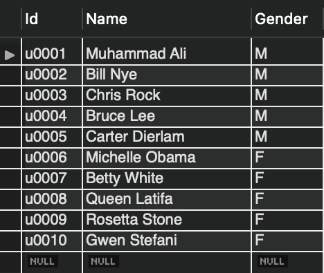
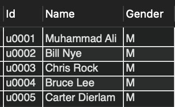
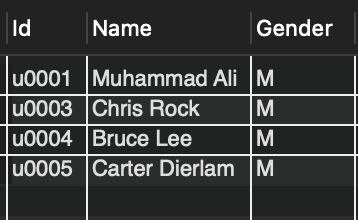
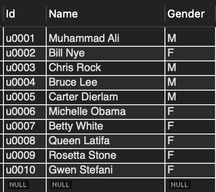
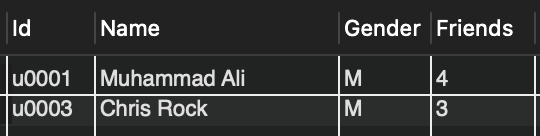

# CS-4163 Project 2

---

## Part 1: API Calls

The `src` folder contains all of the modified code to retrieve the results of query 2 from Project 1.

**Output**:
```
Id Gender Id Gender 
u0007 F u0004 M 
u0009 F u0002 M 
u0010 F u0004 M 
u0004 M u0010 F 
u0003 M u0006 F 
u0003 M u0007 F 
u0003 M u0008 F 
u0003 M u0009 F 
u0003 M u0010 F 
```

---

## Part 2: Views

The requirements for this part were to display one updateable view and one non-updatable view. 

This part of the project used the table of users that was created for Project 1.

### Reference Table


### Updatable View
A simple query displaying male users is used to create an updatable view.
```sql
CREATE VIEW male_users AS
SELECT *
FROM users
WHERE gender = 'M';

SELECT * FROM male_users;
```


```sql
UPDATE male_users
SET gender = 'F'
WHERE name = 'Bill Nye';

SELECT * FROM male_users;
SELECT * FROM users;
```
As you can see, updating Bill Nye's gender, removed him from the `male_users` view

And updated his gender in the table of all users as well.



### Non-Updatable View
Query 7 from Project 1 is used to create a non-updatable view because it includes aggregate functions
```sql
CREATE VIEW talkative_users AS
SELECT U.*, COUNT(*) AS Friends
FROM Users U
	LEFT JOIN Friends F1 ON U.Id = F1.Id1
    LEFT JOIN Friends F2 ON U.Id = F2.Id2 AND F1.Id2 = F2.Id2
WHERE U.Id IN
	(SELECT C.Poster
	 FROM Comments C
     GROUP BY C.Poster
     HAVING COUNT(DISTINCT Recipient) >1)
GROUP BY U.Id;

SELECT * FROM talkative_users;
```

